# INSTITUTO TECNOLÓGICO DE OAXACA
## Ingeniería en Sistemas Computacionales
### Programación Web — Semestre: Ago-Dic 2026 (Horario: 10:00 a 11:00 hrs)

---

# Actividad 5. Proyecto de Login

## Datos de la actividad
* **Materia:** Programación Web
* **Profesora:** Martínez Nieto Adelina
* **Horario:** 10:00 - 11:00 hrs
* **Integrantes del Equipo:**
  * Ruíz Jiménez Erandi Camila
  * Martínez Bautista Karla

---

> Sistema web desarrollado en dos pantallas (`login.html` e `index.html`) que simula un entorno de acceso protegido. Incluye gestión de sesiones mediante `localStorage`, barra lateral (sidebar), barra de navegación superior (navbar) con menú de usuario, y validaciones robustas integrando la librería externa **utileria.js**.

---

## Tecnologías

* **Frontend:** HTML, CSS.

* **Lógica:** JavaScript.

* **Enfoque de Diseño:** El proyecto fue desarrollado utilizando **CSS puro y modular**, estructurado con hojas de estilo independientes (`login.css` para la pantalla de acceso y `style.css` para el panel principal). 

* **Librería Externa de Validaciones:** [`utileria.js`](https://cdn.jsdelivr.net/gh/camicrts5-hash/utileria-js@master/js/utileria.js) (para validación de nombres, correos y contraseñas).
* **Control de Versiones y Despliegue:** Git, GitHub y GitHub Pages.

---

## Documentación

### 1.  Menús y Secciones del Portafolio

**login.html (Acceso y Registro / Auth):**

Descripción: Pantalla de autenticación interactiva que cuenta con un panel deslizante (toggle) dinámico para alternar entre el formulario de Iniciar Sesión y el de Registrarse. Integra validaciones en tiempo real para correos y contraseñas seguras mediante la librería externa utileria.js, gestionando la sesión activa a través de localStorage para permitir el acceso al panel principal.

**index.html (Dashboard Principal / Panel del Sistema):**

Descripción: Interfaz de administración central protegida por sesión que integra una estructura modular compuesta por:

  * Sidebar (Menú Lateral Retráctil): Contiene la sección de Inicio y el menú desplegable Usuarios con su respectivo submenú Captura.

  * Navbar (Barra Superior): Muestra de forma dinámica el usuario autenticado y despliega un menú flotante con la opción de "Salir del sistema", la cual destruye la sesión del localStorage y redirige al usuario de regreso al login.

**Módulo de Captura (#seccion-captura):**

Descripción: Sección de trabajo estructurada en una cuadrícula con dos formularios clave:

  * Formulario de Usuarios: Valida que el nombre de usuario contenga exclusivamente letras, comprueba el formato formal del correo electrónico y verifica una contraseña segura mediante utileria.js.

  * Formulario de Alumnos: Valida estrictamente que el número de control conste de 6 dígitos exactos mediante expresiones regulares y procesa la fecha de nacimiento para calcular la edad exacta. Cuenta con un componente modal interactivo que notifica al instante si el alumno es mayor de edad o menor de edad.

---

### 2. Estructura del Proyecto

El proyecto está organizado de la siguiente manera:
Se configuró el entorno en Visual Studio Code organizando el proyecto en directorios limpios (`/css`, `/js`, `index.html`, `login.html` y `README.md`, `/img`).

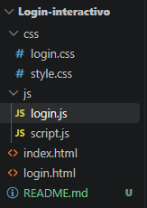

---

### 3. Flujo del Login hacia el Sistema

1. El usuario ingresa sus credenciales en `login.html`.
2. El script `login.js` intercepta el evento de envío (*submit*) y valida los campos utilizando las funciones de la librería externa `utileria.js`.
3. Si las validaciones son correctas, el correo del usuario se almacena temporalmente en el navegador usando **`localStorage.setItem("usuarioActivo", correo)`**.
4. Finalmente, se ejecuta una redirección automática hacia `index.html`. Si un usuario intenta acceder directamente al dashboard sin iniciar sesión, el sistema detecta la ausencia del token en el `localStorage` y lo devuelve automáticamente al login.


### 4. Transferencia del Nombre de Usuario al Navbar

* Al cargar la página `index.html`, el script principal (`script.js`) recupera el correo almacenado mediante `localStorage.getItem("usuarioActivo")`.
* Dicho valor se inyecta de forma dinámica dentro del elemento contenedor del Navbar (`user-display-name`), mostrando el nombre del usuario autenticado en tiempo real. Adicionalmente, este elemento activa un menú desplegable flotante con la opción de cerrar sesión, la cual elimina el registro del `localStorage` y redirige al login.

### 5. Métodos y Funciones Principales

* **`validarCorreo(correo)`:** Verifica que la estructura del correo electrónico cumpla con los estándares formales.
* **`validarPassword(pass)`:** Asegura que la contraseña contenga una longitud mínima de 8 caracteres, al menos una letra mayúscula, una minúscula y un número.
* **`soloLetras(nombre)`:** Valida que los campos de texto no contengan números ni caracteres especiales no permitidos.
* **`calcularEdad(fechaNacimiento)`:** Procesa la fecha seleccionada por el usuario para calcular su edad exacta y determinar si es mayor de edad mediante un componente modal interactivo.

---

## Proceso de Creación

1. **Construcción del Login:** Se diseñó la interfaz de doble panel con un efecto deslizante (*toggle*) usando transiciones fluidas en CSS para alternar entre el inicio de sesión y el registro de nuevos usuarios.

**Fragmento de estructura HTML del login:**
```html
<div class="container" id="auth-container">
      <!-- Formulario Iniciar Sesión -->
      <div class="container-form container-signin">
          <form id="login-form" class="sign-in">
              <h2>Iniciar Sesión</h2>
              <div class="container-input">
                  <ion-icon name="mail-outline"></ion-icon>
                  <input type="email" id="login-correo" placeholder="Email" required>
              </div>
              <div class="container-input">
                  <ion-icon name="lock-closed-outline"></ion-icon>
                  <input type="password" id="login-password" placeholder="Password" required>
              </div>
              <button type="submit" class="button">INICIAR SESIÓN</button>
          </form>
      </div>
      <!-- Panel Verde Desplazable -->
      <div class="container-welcome">
          <div class="welcome-panel welcome-left">
              <h3>¡Hola!</h3>
              <p>Regístrese con sus datos personales para usar todas las funciones</p>
              <button type="button" class="button btn-outline" id="btn-to-signup">Registrarse</button>
          </div>
      </div>
  </div>
```

* Controlador de Transición en JavaScript (login.js):
Se programó la escucha de eventos en los botones de cambio para añadir o remover la clase .toggle sobre el contenedor principal, provocando el desplazamiento animado del panel verde y modificando el radio de sus esquinas.

**Fragmento de código JS:**
```JavaScript
const container = document.querySelector(".container");
const btnToSignUp = document.getElementById("btn-to-signup");
const btnToSignIn = document.getElementById("btn-to-signin");

if (btnToSignUp && container) {
    btnToSignUp.addEventListener("click", () => {
        container.classList.add("toggle");
    });
}

if (btnToSignIn && container) {
    btnToSignIn.addEventListener("click", () => {
        container.classList.remove("toggle");
    });
}
```


2. **Integración del Sidebar, Navbar Dinámico y Control de Sesión (index.html)** 
Se desarrolló el panel de administración lateral (con opción desplegable para el módulo de captura) y la barra superior con el control de sesión del usuario.

* Estructura del Panel de Administración (Dashboard):
Se desarrolló una interfaz basada en Flexbox con una barra lateral fija (sidebar) de color oscuro y un contenedor principal para el contenido dinámico y la barra superior (navbar).

* Gestión de Sesión con localStorage y Transferencia de Usuario:
Al validar exitosamente las credenciales en el login, se almacena el correo del usuario activo utilizando el navegador (localStorage.setItem("usuarioActivo", correo)). Al cargar el dashboard (index.html), el script verifica la existencia de esta clave; si no existe, redirige de inmediato al usuario al login. Si es válida, extrae el texto y lo inyecta en el Navbar para mostrar el nombre del usuario en tiempo real.

**Fragmento de código JS para validación de sesión y Navbar:**

```JavaScript
document.addEventListener("DOMContentLoaded", () => {
    const usuarioActivo = localStorage.getItem("usuarioActivo");
    const userDisplayName = document.getElementById("user-display-name");

    if (usuarioActivo) {
        if (userDisplayName) userDisplayName.textContent = usuarioActivo;
    } else {
        window.location.href = "login.html"; // Protección de ruta
    }

    // Lógica para cerrar sesión
    const btnLogout = document.getElementById("btn-logout");
    if (btnLogout) {
        btnLogout.addEventListener("click", (e) => {
            e.preventDefault();
            localStorage.removeItem("usuarioActivo");
            window.location.href = "login.html";
        });
    }
});
```

3. **Validación de Alumnos, Control Escolar y Componente Modal:** 
Se programó el formulario de control escolar para aceptar estrictamente cadenas numéricas de 6 dígitos y se enlazó el cálculo de la fecha de nacimiento con un componente modal dinámico.

* Formulario de Control Escolar y Expresiones Regulares:
Se implementó un campo de entrada estricto para el número de control del alumno, validando mediante una expresión regular (/^\d{6}$/) que conste exactamente de 6 dígitos numéricos, evitando caracteres alfabéticos o longitudes incorrectas.

* Cálculo de Edad y Activación del Modal Dinámico:
Se enlazó la fecha de nacimiento seleccionada por el usuario con la función calcularEdad de la librería externa utileria.js. Dependiendo del resultado numérico obtenido, se evalúa si el alumno es mayor de edad ($\ge 18$ años) y se despliega un componente modal interactivo en pantalla que muestra el resultado de forma visual y limpia.Fragmento de código JS para la validación de alumnos y control del Modal:

```JavaScript
const formAlumno = document.getElementById("form-alumno");
const modalEdad = document.getElementById("modal-edad");
const modalTextoEdad = document.getElementById("modal-texto-edad");

if (formAlumno) {
    formAlumno.addEventListener("submit", (e) => {
        e.preventDefault();
        const numControl = document.getElementById("num-control").value;
        const fechaNac = document.getElementById("fecha-nacimiento").value;
        let esValido = true;
        const errControl = document.getElementById("err-control");

        // Validación de 6 dígitos exactos
        const regexControl = /^\d{6}$/;
        if (!regexControl.test(numControl)) {
            if (errControl) errControl.textContent = "El número de control debe ser de 6 dígitos.";
            esValido = false;
        } else {
            if (errControl) errControl.textContent = "";
        }

        if (esValido) {
            // Uso de la función externa calcularEdad
            const edad = calcularEdad(fechaNac);
            const mayor = edad >= 18;

            if (modalTextoEdad) {
                modalTextoEdad.textContent = `Edad calculada: ${edad} años. El alumno ${mayor ? "SÍ es mayor de edad" : "NO es mayor de edad"}.`;
            }
            if (modalEdad) {
                modalEdad.classList.add("active"); // Muestra el modal
            }
        }
    });
}
```

---

## Demostración del Sistema

**Captutras finales**

>Pantalla de Login:

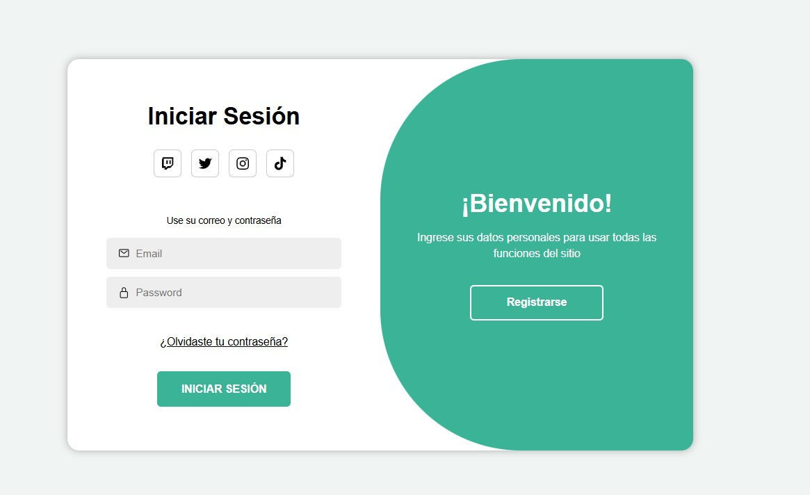
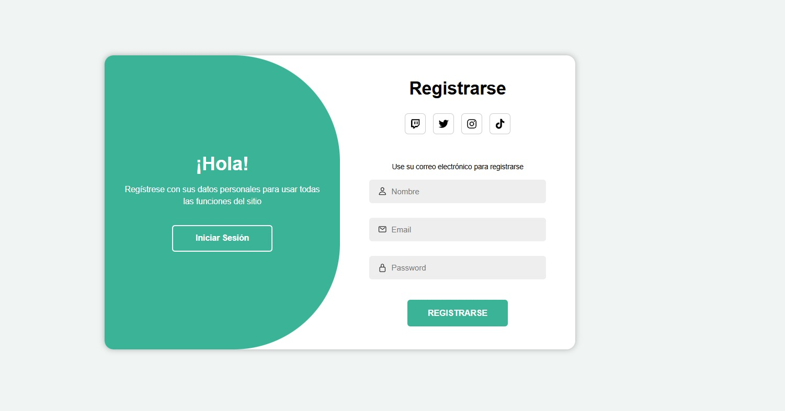
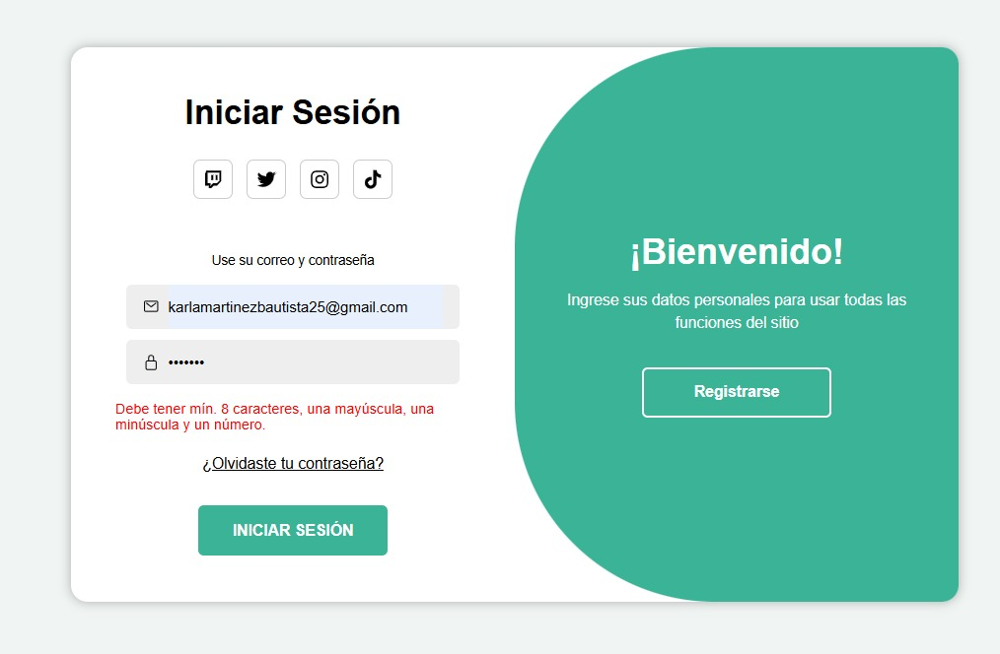
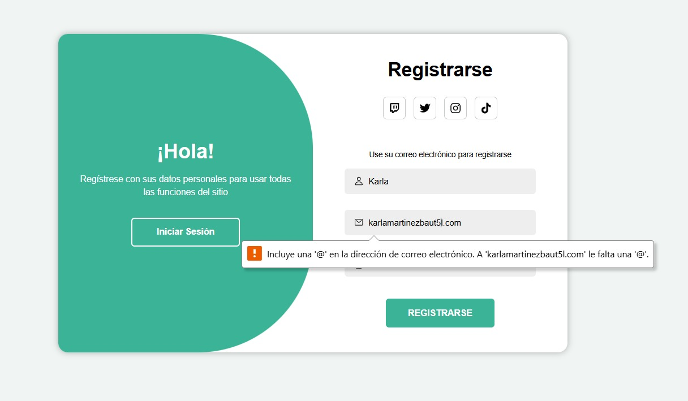
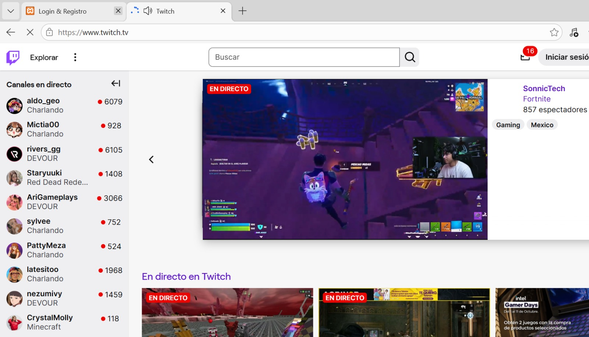

>Inicio y Sidebar:

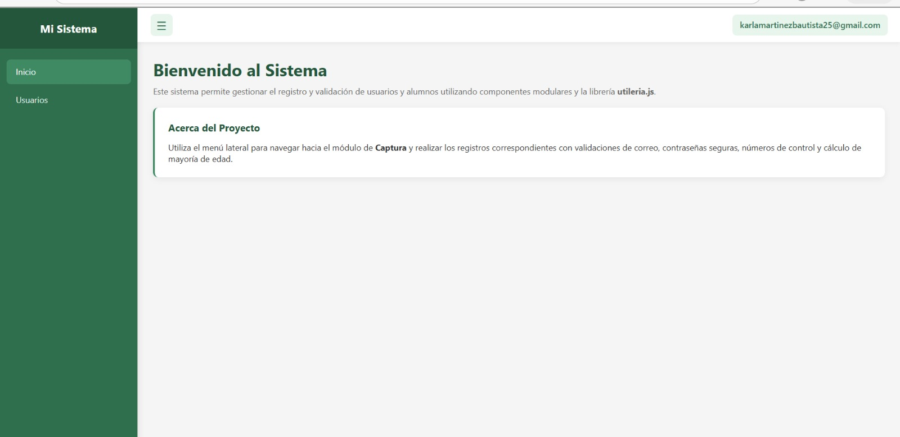
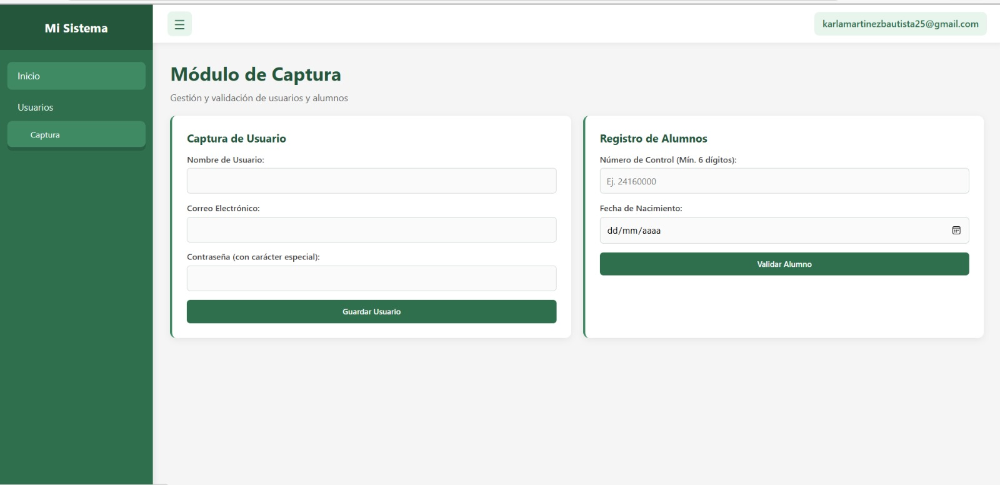
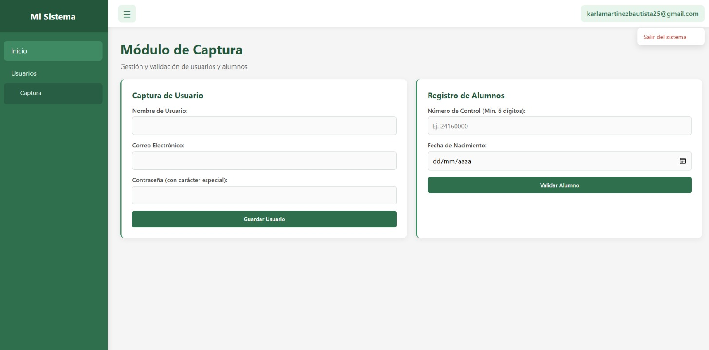

>Validaciones:
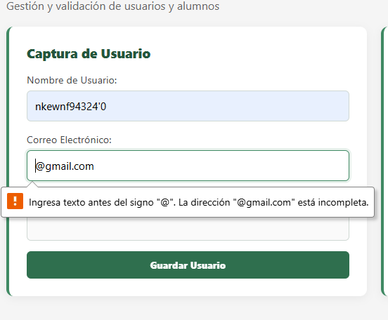
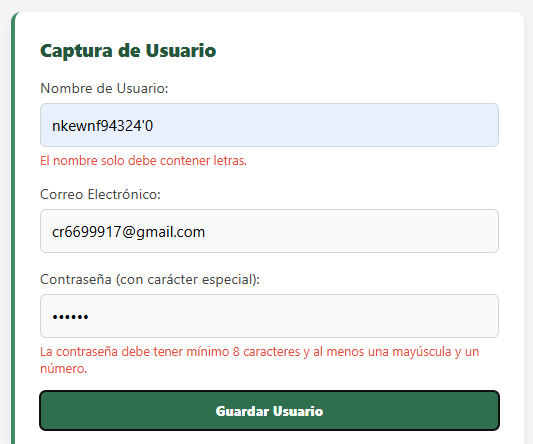
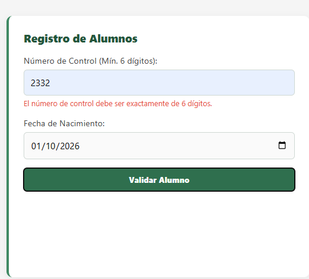
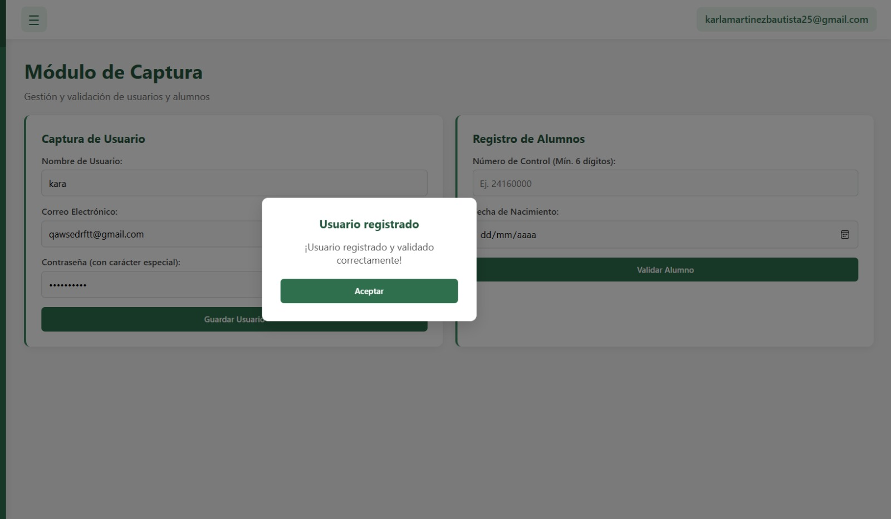
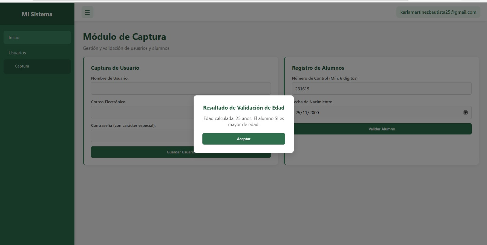
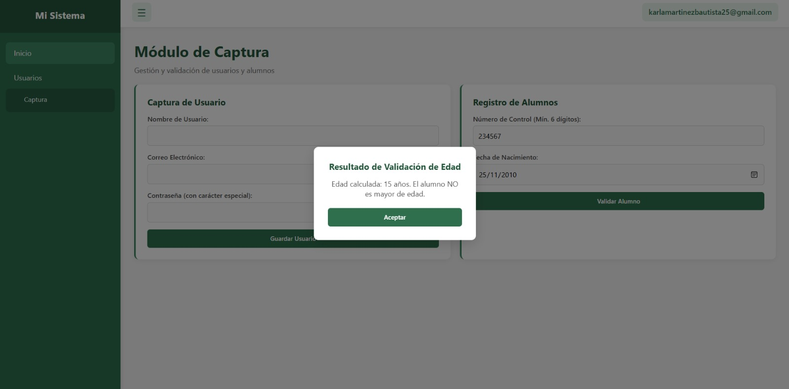
